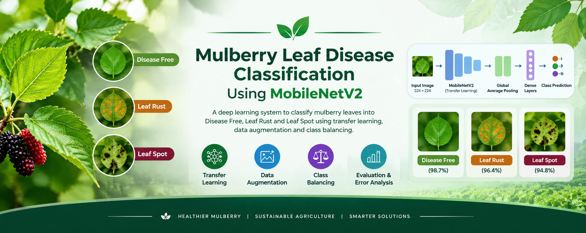

# 🌿 Mulberry Leaf Disease Classification Using MobileNetV2

<p align="center">
  
</p>

<p align="center">
  <b>Deep Learning | Computer Vision | Transfer Learning | Agricultural AI</b>
</p>

<p align="center">
  A deep learning system for classifying mulberry leaves into Disease Free, Leaf Rust, and Leaf Spot using MobileNetV2 transfer learning.
</p>

---

## 📌 Overview

This project focuses on automated **mulberry leaf disease classification** using deep learning and computer vision.

The system takes an image of a mulberry leaf as input and classifies it into one of three categories:

- 🌿 **Disease Free**
- 🟠 **Leaf Rust**
- 🟣 **Leaf Spot**

The machine learning component was developed using **TensorFlow/Keras** and **MobileNetV2** with ImageNet-pretrained weights.

The project includes:

- Dataset analysis
- Image preprocessing
- Stratified train/validation/test splitting
- Data augmentation
- Class imbalance handling
- Transfer learning
- Model training
- Model evaluation
- Confusion matrix analysis
- Error analysis
- Single-image inference

---

## 🎯 Problem Statement

Mulberry leaves can be affected by different diseases that may impact plant health and agricultural productivity.

Manual identification of leaf diseases can be:

- Time-consuming
- Dependent on human expertise
- Difficult to perform consistently
- Challenging when symptoms have similar visual characteristics

This project explores the use of **computer vision and deep learning** to automatically classify mulberry leaf images into predefined disease categories.

---

## 🧠 Project Objective

The objective of the ML component is to develop an image classification model that can distinguish between:

| Class | Description |
|---|---|
| 🌿 Disease Free | Healthy mulberry leaf |
| 🟠 Leaf Rust | Mulberry leaf affected by leaf rust |
| 🟣 Leaf Spot | Mulberry leaf showing leaf spot symptoms |

The trained model is evaluated on a **held-out test set** that is not used during training.

---

# 📊 Dataset

The original dataset contains:

| Class | Number of Images |
|---|---:|
| Disease Free | 440 |
| Leaf Rust | 489 |
| Leaf spot | 162 |
| **Total** | **1,091** |

### Dataset characteristics

- Total images: **1,091**
- Image format: **JPEG**
- Number of classes: **3**
- Original image resolutions vary considerably.
- No corrupted images were found during dataset inspection.

Some of the original image resolutions included:

- 6000 × 4000
- 9280 × 6944
- and other varying resolutions

The model therefore performs image resizing before feeding images into the neural network.

> ⚠️ The original dataset is not included in this repository unless permission is available to redistribute it.

---

# 🔎 Dataset Analysis

Before training the model, the dataset was inspected to understand:

- Number of images
- Class distribution
- Image formats
- Image dimensions
- Corrupted images
- Class imbalance

One important issue discovered during the initial pipeline was an **invalid validation split**.

The initial automated directory split resulted in the validation set containing no **Disease Free** images.

This could produce a misleading validation accuracy because one of the three classes was not represented in validation.

### Initial issue

```text
Training:
Disease Free → 440
Leaf Rust    → 433

Validation:
Leaf Rust    → 56
Leaf spot    → 162

Disease Free → 0

# ✂️ Stratified Dataset Splitting

A custom **stratified splitting pipeline** was implemented to ensure that all three classes were represented in the training, validation, and test sets.

The final dataset split was:

| Dataset | Total | Disease Free | Leaf Rust | Leaf spot |
|---|---:|---:|---:|---:|
| Train | 763 | 308 | 342 | 113 |
| Validation | 163 | 66 | 73 | 24 |
| Test | 165 | 66 | 74 | 25 |
| **Total** | **1,091** | **440** | **489** | **162** |

### Split Ratio

```text
70% → Training
15% → Validation
15% → Testing

```markdown
# 🏗️ Model Architecture

The final model uses **MobileNetV2 with ImageNet-pretrained weights**.

### Architecture Flow

```text
Input Image
     │
     ▼
Resize to 224 × 224
     │
     ▼
Data Augmentation
     │
     ▼
MobileNetV2
(ImageNet Pretrained)
     │
     ▼
Global Average Pooling
     │
     ▼
Dropout (0.3)
     │
     ▼
Dense Layer
3 Output Classes
     │
     ▼
Softmax
     │
     ▼
Class Prediction
